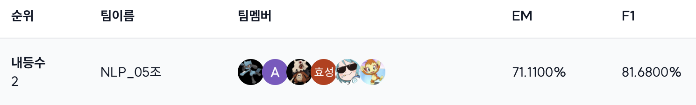
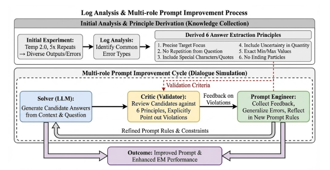

# PromptReflect

**Multi-Agent Self-Reflection Loop for Automated Prompt Optimization**

Solver-Critic-Optimizer 아키텍처 기반 프롬프트 자동 최적화 — Inspired by [Reflexion](https://arxiv.org/abs/2303.11366) & [TextGrad](https://github.com/zou-group/textgrad)

---

## 대회 소개

**네이버 커넥트재단 부스트캠프 AI Tech 8기** — Open-Domain Question Answering

일반 기계독해와 달리 질문에 대한 지문이 미리 주어지지 않기 때문에, Knowledge Resource(Wikipedia 문서 더미)에서 관련 문서를 직접 검색하는 **Retriever**와 문서를 읽고 답변을 생성하는 **Reader**가 필요한 태스크입니다.

- **Task**: 질문에 적합한 문서를 찾는 Retriever와 해당 문서에서 정답을 추출하는 Reader 모델 구축
- **Duration**: 2025.12.01 ~ 2025.12.11
- **Evaluation Metric**: Exact Match (EM)
- **Team Repository**: [pro-nlp-mrc-nlp-05](https://github.com/boostcampaitech8/pro-nlp-mrc-nlp-05/tree/develop)

### Result

| 리더보드 | 순위 |
|----------|------|
| **Private** | **2위** |

> 본 프로젝트(PromptReflect)는 위 대회의 **Reader 성능 최적화**를 위해 개발한 프롬프트 자동 최적화 시스템입니다.

---

## 목차

1. [프로젝트 개요](#1-프로젝트-개요)
2. [영감을 받은 구조: Reflexion + TextGrad](#2-영감을-받은-구조-reflexion--textgrad)
3. [문제 정의 및 접근 방향](#3-문제-정의-및-접근-방향)
4. [방법론](#4-방법론)
5. [아키텍처](#5-아키텍처)
6. [실험 결과](#6-실험-결과)
7. [Lessons Learned](#7-lessons-learned)
8. [빠른 시작](#8-빠른-시작)
9. [참고 자료](#9-참고-자료)

---

## 1. 프로젝트 개요

이 프로젝트는 **EM(Exact Match) 기반 한국어 QA 태스크**를 위한 프롬프트 자동 최적화 시스템입니다.

TextGrad의 텍스트 기반 최적화 철학과 Reflexion의 Multi-Agent 자기 개선 구조를 결합하여, 한국어 EM QA에 특화된 프롬프트 자동 최적화 시스템을 설계했습니다. 파라미터 업데이트 없이, **언어적 피드백만으로 프롬프트를 반복 개선**합니다.

### 1.1 왜 디코더 모델인가?

전통적인 Extractive MRC(인코더 기반 span 추출)는 "정답이 포함된 context가 이미 주어진 상태"를 가정합니다.
하지만 실제 QA 시스템은 다음과 같은 파이프라인으로 동작합니다:

```
사용자 질문 → 의도 파악 → 검색(Retrieval) → 답변 생성
```

이 과정에서 Reader 역할은 대부분 디코더 기반 LLM이 담당합니다.
따라서 본 프로젝트에서도 디코더 모델을 활용하여 현실적인 RAG 환경을 반영하고자 했습니다.

| 구분 | 인코더 (RoBERTa) | 디코더 (LLM) |
|------|------------------|--------------|
| 방식 | Start/End 토큰 확률 예측 | 자유로운 텍스트 생성 |
| 장점 | EM에 최적화된 정확한 span 추출 | 문맥 이해력, 추론 능력 |
| 단점 | 추론 필요 시 confidence 저하 | 서술형 응답 경향, EM 부적합 출력 |

### 1.2 핵심 발견

실험 중 발견한 패턴:

```
질문: "캐나다의 기후는?"
모델: "캐나다는 냉대기후권에 속하며..." ✅ 정답 문장은 정확히 찾음
     → "냉대기후권" ❌ 하지만 "권" 같은 불필요한 단어 포함

질문: "액운공사에 대한 설명이 나와있는 저서는?"
모델: "대순경전" ❌
정답: 〈대순경전〉 ✅ (특수문자 누락)
```

#### 디코더 출력 예시

```
SPAN: "이 노선은 이후 1871년 11월에 캐닝턴까지 연장되었고 1872년 11월에 코보콘크까지 완공되었다."

Key_Wording: "스카버러 남쪽과 코보콘크 마을의 철도 노선", "처음 연장된 연도"

Reasoning: 문맥에서 스카버러 남쪽과 코보콘크 마을을 잇는 철도 노선의 연장 정보는
1871년 11월에 캐닝턴까지 연장된 이후 1872년 11월에 코보콘크까지 완공되었다고 되어 있다.
그러나 질문은 "처음 연장된 연도"를 묻고 있으므로, 가장 먼저 연장된 시점인 1871년이 정답이다.

{"extracted_answer": "1871년"}
```

**핵심 통찰**: 디코더 모델은 정답이 포함된 문장(Span)을 정밀하게 찾아내지만,
최종 답변 생성 단계에서 EM 기준에 맞지 않는 형태로 출력합니다.
이는 Instruct 방식으로 학습된 디코더 모델의 서술형 응답 경향 때문입니다.

### 1.3 핵심 특징

- **Solver-Critic-Optimizer 아키텍처**: Reflexion의 Actor-Evaluator-Self-Reflection 구조를 프롬프트 최적화에 적용
- **6가지 평가 원칙**: 로그 분석으로 도출한 EM 최적화 원칙 (TextGrad의 Loss를 도메인 특화)
- **20% 샘플링**: 일관적이지 않은 정답 기준으로 인한 과적합 방지
- **자동 롤백**: 성능 저하 시 이전 프롬프트로 복구
- **AI Compound 전략**: Extractive QA와 LLM의 하이브리드 접근

---

## 2. 영감을 받은 구조: Reflexion + TextGrad

### 2.1 이 프로젝트의 위치

본 프로젝트는 단일 프레임워크의 구현이 아니라, **Reflexion과 TextGrad의 하이브리드**입니다.

```
Reflexion (2023) ─── "언어적 피드백으로 에이전트 행동을 개선"
    │                 Actor-Evaluator-Self-Reflection 구조
    │
TextGrad (2024) ─── "텍스트로 된 모든 변수를 최적화"
    │                 Loss → Gradient → Variable Update 프레임워크
    │
PromptReflect ──── 두 구조를 결합하여 EM QA에 특화
                    Solver-Critic-Optimizer + 도메인 특화 Loss/Gradient
```

### 2.2 구조적 대응 관계

세 시스템의 역할이 일대일로 대응됩니다:

| Reflexion | TextGrad | PromptReflect |
|---|---|---|
| Actor | Variable (최적화 대상) | **Solver** |
| Evaluator | Loss Function | **Critic** (6가지 원칙) |
| Self-Reflection | Gradient (텍스트 피드백) | **Optimizer** |
| Memory (반성문) | Updated Variable | 업데이트된 프롬프트 |

루프도 동일합니다:

```
Reflexion:     행동 → 평가 → 반성 → 메모리 저장 → 다음 시도에 반영
TextGrad:      forward → loss 계산 → gradient 생성 → 변수 업데이트
PromptReflect: Solver 추론 → Critic 분석 → Optimizer 재작성 → 프롬프트 업데이트
```

### 2.3 Reflexion에서 가져온 것

- **Multi-Agent 역할 분리**: 단일 모델이 아닌, 추론·평가·개선을 분리된 에이전트가 담당
- **반복적 자기 개선 루프**: 실패 경험을 분석하고 다음 시도에 반영하는 구조
- **실패 경험 기반 학습**: "왜 틀렸는지"를 언어로 분석하여 개선

### 2.4 TextGrad에서 가져온 것

- **"Automatic Differentiation via Text" 철학**: 모든 것을 자연어로 처리
- **Loss → Gradient → Update 프레임워크**: PyTorch의 학습 루프를 텍스트 공간에서 모방

### 2.5 프로젝트 고유의 기여

- **도메인 특화 Loss**: 범용 평가 → 6가지 EM 특화 원칙으로 명시화
- **구조화된 Gradient**: 자유 텍스트 피드백 → "원칙 N 위반" 형식의 정형화된 피드백
- **과적합 방지 메커니즘**: 20% 샘플링 + 자동 롤백 + 조기 종료 + 규칙 수 제한
- **AI Compound**: Extractive QA + LLM의 confidence 기반 하이브리드

---

## 3. 문제 정의 및 접근 방향

### 3.1 환경 제약

- **파인튜닝 불가**: 모델 규모 제약으로 추론만 가능
- **데이터 제한**: 학습 데이터 4,192개로 EM 패턴 일반화 어려움
- **EM 평가의 이진성**: 단 한 글자 차이로 0점 처리

### 3.2 접근 방향: 프롬프트 엔지니어링 자동화

모델 학습 대신 **프롬프트 엔지니어링을 통해 LLM 출력을 제어**하는 방향을 선택했습니다.

| 프레임워크 | 특징 | 본 프로젝트 결과 |
|------------|------|------------------|
| TextGrad | 텍스트 기반 경사하강법, 피드백 기반 개선 | 유의미한 성능 향상 확인 |
| DSPy | 프롬프트를 코드 변수로 취급 | 뚜렷한 개선 미확인 |

### 3.3 왜 TextGrad 라이브러리를 직접 사용하지 않았는가?

TextGrad는 "Automatic Differentiation **via Text**"라는 개념으로, 모든 것을 자연어로 처리합니다:

- **손실함수 (Loss)**: 자연어 프롬프트로 표현된 평가 기준
- **역전파 (Gradient)**: LLM이 자동 생성한 텍스트 피드백
- PyTorch의 학습 과정을 **텍스트 공간**에서 모방

본 프로젝트도 이 철학을 따르지만, **EM(Exact Match) 평가 기준**의 특수성 때문에 커스터마이징이 필요했습니다.

#### EM 평가의 특수성

```python
# 단 하나의 특수문자 차이로 0점 처리
모델: "대순경전"      → EM = 0 ❌
정답: "〈대순경전〉"    → EM = 1 ✅

# "권" 한 글자 차이로 0점 처리
모델: "냉대기후권"    → EM = 0 ❌
정답: "냉대기후"      → EM = 1 ✅
```

#### 일관적이지 않은 정답 기준

EM 평가는 다음 요소들이 **일관적이지 않게** 적용됩니다:
- 특수문자 (`<>`, `()`, `""`, `''`, `『』`, `《》`) 포함 여부
- 조사 (`~에서`, `~이/가`, `~은/는`) 포함 여부
- 수식어 및 관형사 포함 범위
- 복합명사의 분리 정도

```python
[FAIL] Pred: '펜실베이니아주' vs GT: '펜실베이니아주 출신'
[FAIL] Pred: '서남쪽의 포좌부분' vs GT: '서남쪽'
[FAIL] Pred: '스텐코프의 혹' vs GT: '혹'
[FAIL] Pred: '문치미르' vs GT: '트르피미로비치 왕조(Trpimirović) 출신의 문치미르'
```

이러한 상충되는 피드백이 Critic → Optimizer 과정에서 누적되면서:

1. **너무 단답형으로 치우치는 경향**: "스텐코프의 혹" → "혹"으로 학습
2. **서술형으로 치우치는 경향**: "펜실베이니아주" → "펜실베이니아주 출신"으로 학습

Optimizer가 **단답형과 서술형 사이에서 진동**하는 과적합 문제가 발생합니다.

#### 커스터마이징 요약

| 항목 | TextGrad 원본 | PromptReflect | 개선 이유 |
|------|---------------|---------------|-----------|
| **Loss** | 자연어 (범용 평가) | EM/F1 + 6가지 원칙 | EM 특화 |
| **Gradient** | LLM 자유 생성 | Critic (원칙 위반 명시) | 구조화된 피드백 |
| **최적화** | Gradient Descent 흉내 | Rule-based Refinement | 이진적 EM 대응 |
| **일반화** | 전체 오답 학습 | 20% 샘플링 + 추상화 | 과적합 방지 |
| **Multi-role** | ❌ 단일 모델 | ✅ Solver-Critic-Optimizer | 역할 분리 |

---

## 4. 방법론

### 4.1 정답 추출 6가지 원칙

Temperature 2.0 + 5회 반복 추론으로 다양한 오답 패턴을 수집하고, 로그 분석을 통해 다음 원칙을 도출했습니다.

**원칙 1. 질문이 묻는 대상을 정확하게 가리키는 답을 선택한다**

| 질문 | 잘못된 응답 | 올바른 응답 |
|------|-------------|-------------|
| 캐나다의 기후는? | 냉대기후권 | 냉대기후 |
| 무엇으로 가득한 기억을 떠올리지 못하나? | 고통스럽고 중요한 기억 | 고통 |
| 근대적 대기업은 무엇을 야기하였나? | 경영자 자본주의를 야기... | 경영자 자본주의 |

**원칙 2. 질문에 이미 포함된 표현을 답에 반복하지 않는다**

| 질문 | 잘못된 응답 | 올바른 응답 |
|------|-------------|-------------|
| 곤란을 겪는 화자는? | 브라질 포르투갈어 화자 | 브라질 포르투갈어 |
| 헤라클레스가 살해한 인물은 누구의 혈연? | 오이네우스의 친족 | 오이네우스 |

**원칙 3. 답이 특수문자로 감싸져 있으면 포함하여 추출한다**

| 질문 | 잘못된 응답 | 올바른 응답 |
|------|-------------|-------------|
| UFO로 인식되는 물체는? | 정체불명의 씨앗 | "정체불명의 씨앗" |
| 대내림 뒤 다음 순서는? | 돌돌이 | '돌돌이' |
| 액운공사에 대한 저서는? | 대순경전 | 〈대순경전〉 |

**원칙 4. 수량 질문에서 불확실성 표현까지 포함한다**
- 예: "대략 3천 명" (O) vs "3천 명" (X)

**원칙 5. 최솟값/최댓값을 묻는 경우 해당 값만 추출한다**
- 예: "100달러" (O) vs "100달러에서 200달러" (X)

**원칙 6. 답은 조사로 끝맺지 않는다**

| 질문 | 잘못된 응답 | 올바른 응답 |
|------|-------------|-------------|
| 균이 길러지는 곳은? | 중형일개미들이 가져온 잎에서 | 중형일개미들이 가져온 잎 |

### 4.2 Multi-Agent Self-Reflection 아키텍처


```
┌──────────────┐
│   Solver     │  ← 현재 프롬프트로 QA 추론
└──────┬───────┘
       │ 오답 수집
       ↓
┌──────────────┐
│    Critic    │  ← 샘플링(20%) + 6가지 원칙 기반 오류 분석
└──────┬───────┘
       │ 일반화된 피드백
       ↓
┌──────────────┐
│  Optimizer   │  ← 프롬프트 재작성 (5~7개 규칙으로 제한)
└──────┬───────┘
       │ 업데이트
       ↓
    (반복)
```

| 역할 | 책임 | Reflexion 대응 |
|------|------|----------------|
| Solver | context 기반 정답 후보 생성 | Actor |
| Critic | 정답 추출 원칙 위반 여부 검토, 위반 원칙 명시 | Evaluator |
| Optimizer | 피드백 수집 → 오류 유형 일반화 → 프롬프트 규칙 반영 | Self-Reflection |

#### Critic 프롬프트

```python
critique_prompt = """
다음은 모델이 틀린 케이스들입니다:

{cases_text}

**수행 과제:**
위 케이스들을 분석하여 아래 형식으로 출력하십시오.

**출력 형식 (반드시 준수):**
각 케이스에 대해 아래 포맷을 엄격히 따르십시오.

[Case N]
- 차이: [모델의 오답] vs [정답] 간의 텍스트 차이 분석
- 원인: **[위반 원칙 번호]**를 먼저 쓰고, 해당 원칙에 위배되는 이유를 설명
  (예: "원칙 2 위반 - 질문에 있는 단어 '화자'가 답에 중복됨")
- 지시: 정답을 도출하기 위해 모델이 수정해야 할 구체적인 행동

---

**마지막 공통 패턴 요약:**
위 케이스 분석을 바탕으로, 가장 빈번하게 무시된 원칙과 해결책 3가지를 도출하십시오.

1. [위반 원칙/문제점] -> [해결을 위한 지시사항]
2. [위반 원칙/문제점] -> [해결을 위한 지시사항]
3. [위반 원칙/문제점] -> [해결을 위한 지시사항]
"""
```

#### Optimizer 프롬프트

```python
optimization_prompt = f"""당신은 NLP 정보 추출(Information Extraction) 최적화 전문 프롬프트 엔지니어입니다.
당신의 임무는 주어진 [피드백]을 분석하여, EM(Exact Match) 점수를 100점으로 만들기 위해
[현재 시스템 프롬프트]를 재작성하는 것입니다.

[현재 시스템 프롬프트]
{current_prompt}

[검증 데이터에서의 피드백 (Critical Feedback)]
{summarized_feedback}

[프롬프트 재작성 가이드라인]

1. 규칙의 추상화 및 일반화 (Rule Abstraction):
   - 피드백의 개별 사례에 집착하지 말고, **오류의 원인(Error Type)**을 분석하여
     일반화된 규칙을 도출하십시오.
   - (예: "가루아에서 -> 가루아" (X) / "장소 명사 뒤의 격조사(~에서, ~에)는 제거한다" (O))
   - 유사한 오류들은 하나의 강력한 상위 규칙으로 통합하십시오.

2. Few-Shot 예시 (Crucial):
   - 피드백에서 지적된 오류 케이스를 해결할 수 있는 **새로운 Few-Shot 예시(Input-Output 쌍)**를
     반드시 포함하십시오.

3. 출력 포맷 엄격화:
   - 모델이 추론 과정(Evidence)과 결과(Answer)를 분리하도록 아래 JSON 포맷을 강제하십시오.

{{
    "Evidence": "정답을 도출하기 위한 근거 문장 발췌 및 정제 과정 서술",
    "extracted_answer": "최종 정답 문자열"
}}
"""
```

#### 초기 System Prompt

```python
initial_sys_prompt = """
당신은 엄격한 '정보 추출기(Information Extractor)'입니다.
주어진 문맥(context)에서 사용자의 질문에 대한 정답을 찾아 정확히 추출하십시오.

[수행 단계]
1. **근거 포착 (Locate)**: 문맥에서 정답이 포함된 문장을 찾아 그대로 인용하십시오.
2. **정답 추출 (Extract)**: 근거 문장에서 핵심 단어(명사, 숫자, 날짜, 명칭)만 추출하십시오.

[정답 추출 원칙]
1. **Substring Match**: 정답은 문맥에 있는 글자 그대로여야 함 (의역/변형 금지)
2. **조사/서술어 금지**: "은/는/이/가", "~이다" 등 절대 포함 금지
3. **핵심 단어만**: 질문의 핵심에 해당하는 명사/숫자/날짜만 추출
   예외) context에 [...], <...>, 《...》, '...'가 핵심단어와 있을 경우 함께 추출합니다.

[출력 형식]
Evidence: "정답이_포함된_문장"
{"extracted_answer": "핵심_정답"}
"""
```

### 4.3 AI Compound 전략

Extractive QA 모델의 **confidence를 기준으로 LLM을 조건부 활용**하는 하이브리드 전략입니다.

```python
def ai_compound_predict(question, context, threshold=0.85):
    answer, confidence = roberta_qa(question, context)

    if confidence >= threshold:
        return answer  # Extractive QA 결과 사용
    else:
        return llm_qa(question, context)  # LLM으로 추론
```

- **Extractive QA**: EM에 최적화된 정확한 span 추출
- **LLM**: 복잡한 추론이 필요한 경우 문맥 이해 능력 활용

---

## 5. 아키텍처

### 5.1 전체 구조

```
┌─────────────────────────────────────────────────────────┐
│                    AI Compound Layer                     │
│  ┌────────────────┐              ┌──────────────────┐  │
│  │ Extractive QA  │              │   LLM (Qwen)     │  │
│  │ (RoBERTa)      │              │ + PromptReflect  │  │
│  └────────┬───────┘              └────────┬─────────┘  │
│           │ confidence >= 0.85?           │            │
│           └───────────┬───────────────────┘            │
│                       ↓                                 │
│                  Final Answer                           │
└─────────────────────────────────────────────────────────┘
```

### 5.2 프로젝트 구조

```
promptreflect/
├── configs/
│   ├── config.yaml
│   └── prompts/
├── src/
│   ├── train.py          # 메인 실행
│   ├── qa_engine.py      # Solver
│   ├── optimizer.py      # Critic + Optimizer
│   └── metrics.py        # EM, F1 계산
├── experiments/          # 실험 결과
└── README.md
```

---

## 6. 실험 결과

### 6.1 성능 비교

| Model | Type | EM Score | F1 Score | Improvement |
|-------|------|----------|----------|-------------|
| Qwen3-Instruct | Base | 0.6542 | - | - |
| | **Tuned** | **0.7000** | **0.7860** | **+7.0%** |
| Gemma3-27b-it | Base | 0.6750 | 0.7632 | - |
| | **Tuned** | **0.7042** | **0.7767** | **+4.3%** |

### 6.2 주요 관찰 (Validation Set 기준)

1. **일관된 성능 향상**: 두 모델 모두 적용 후 EM 향상
2. **Qwen3에서 더 큰 개선폭**: 초기 성능은 낮지만 최적화 효과가 더 큼
3. **F1 > EM**: 토큰 중첩도 기준 F1이 완전 일치 기준 EM보다 높음

---

## 7. Lessons Learned

### 7.1 Test Set 일반화 실패

⚠️ **위 결과는 Validation Set 기준이며, Test Set에서는 유의미한 성능 향상을 확인하지 못했습니다.**

#### 과적합 발생 구조

```
[Validation 120개] ──→ evaluate() ──→ failures 수집
                              ↓
                    Critic (20% 샘플링)
                              ↓
                    Optimizer (프롬프트 재작성)
                              ↓
                    다시 같은 120개로 evaluate()  ← 문제 지점
                              ↓
                           (반복)
```

**동일한 데이터로 평가 + 최적화를 반복**하는 구조에서 해당 데이터에 특화된 프롬프트가 생성되었습니다.

#### 구체적 원인

| 원인 | 설명 |
|------|------|
| **6가지 원칙** | Validation set 오답 패턴에서 도출 → Test에 없는 패턴일 수 있음 |
| **20% 샘플링** | 120개의 20% = 24개 → 여전히 적어 특이 케이스 영향 큼 |
| **Few-shot 예시** | Optimizer가 Validation 오답 기반으로 생성 → 해당 데이터에 특화 |
| **EM의 이진성** | 정답 기준 불일치로 인해 상충되는 피드백 누적 |

### 7.2 교훈

20% 샘플링, 롤백, 조기종료 등 과적합 방지 장치가 있었지만 **동일 데이터 반복 평가의 구조적 한계**를 극복하지 못했습니다. TextGrad 방식 자체의 한계라기보다, **EM 평가의 이진성 + 정답 기준 불일치 + 작은 데이터셋** 조합이 프롬프트 최적화의 일반화를 어렵게 만든 것으로 분석됩니다.

### 7.3 Reflexion과의 연결

이 실패는 Reflexion 논문의 근본적 한계와도 연결됩니다. Reflexion은 **같은 과제를 반복**하면서 반성하는 구조이기 때문에, 본 적 없는 새로운 유형의 과제에는 반성이 전이되지 않습니다. PromptReflect에서 Validation set에 특화된 프롬프트가 Test set에 일반화되지 않은 것도 본질적으로 같은 문제 — **경험의 일반화**가 이 패러다임 전체의 미해결 과제입니다.

---

## 8. 빠른 시작

### 8.1 설치

```bash
cd promptreflect

# CUDA 지원 llama-cpp-python 설치 (GPU 사용 시)
CMAKE_ARGS="-DGGML_CUDA=on" pip install llama-cpp-python

pip install -r requirements.txt
```

### 8.2 실행

```bash
cd src
python train.py
```

### 8.3 설정 변경 (Hydra)

```bash
python train.py optimizer.num_epochs=5
python train.py critic.sample_ratio=0.3
```

### 8.4 주요 설정

```yaml
# configs/config.yaml
model:
  repo_id: "unsloth/Qwen3-30B-A3B-Instruct-2507-GGUF"
  n_gpu_layers: -1

critic:
  sample_ratio: 0.2  # 오답의 20%만 샘플링

optimizer:
  num_epochs: 10
  max_consecutive_failures: 3  # 3회 연속 실패 시 조기 종료

prompt:
  max_rules: 7  # 최대 규칙 개수
```

### 8.5 출력 구조

```
experiments/
├── prompts/
│   ├── epoch_01_prompt.txt
│   └── ...
├── logs/
│   ├── epoch_01_failures.json
│   └── ...
├── best_prompt.txt
└── summary.json
```

---

## 9. 참고 자료

### 9.1 학술적 계보

| 논문 | 기여 | 본 프로젝트에 미친 영향 |
|------|------|-------------------------|
| [Reflexion](https://arxiv.org/abs/2303.11366) (2023) | 언어적 피드백으로 에이전트 자기 개선 | Multi-Agent 역할 분리, 반복 개선 루프 |
| [TextGrad](https://arxiv.org/abs/2406.07496) (2024) | 텍스트 기반 자동 미분 프레임워크 | Loss → Gradient → Update 철학 |

### 9.2 관련 프레임워크

- **[TextGrad](https://github.com/zou-group/textgrad)** — Automatic Differentiation via Text
- **[KorQuAD](https://korquad.github.io/)** — Korean QA Dataset
- **[ChatDev](https://github.com/OpenBMB/ChatDev), [AutoGen](https://github.com/microsoft/autogen)** — Multi-agent collaboration frameworks

---

## 10. 라이선스

MIT License
